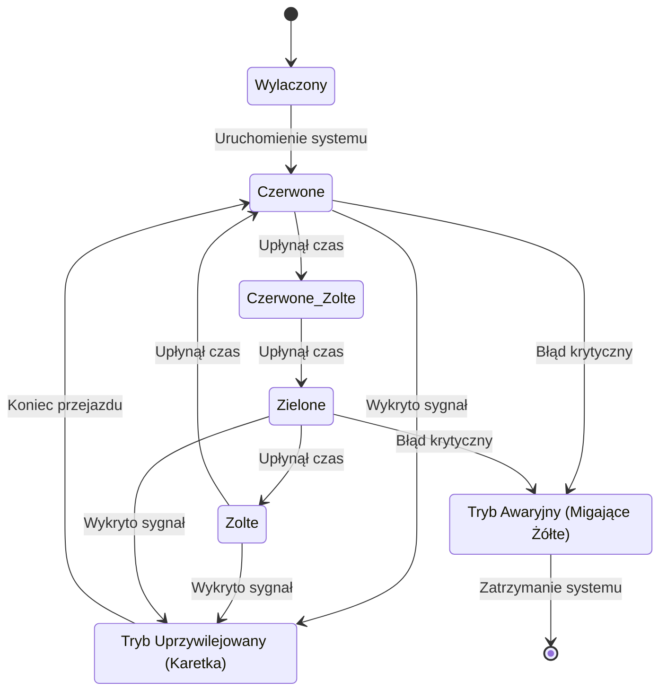

```mermaid
stateDiagram-v2
    [*] --> Wylaczony
    Wylaczony --> Czerwone : Uruchomienie systemu
    
    Czerwone --> Czerwone_Zolte : Upłynął czas
    Czerwone_Zolte --> Zielone : Upłynął czas
    Zielone --> Zolte : Upłynął czas
    Zolte --> Czerwone : Upłynął czas
    
    state "Tryb Uprzywilejowany (Karetka)" as Karetka
    Czerwone --> Karetka : Wykryto sygnał
    Zolte --> Karetka : Wykryto sygnał
    Zielone --> Karetka : Wykryto sygnał
    Karetka --> Czerwone : Koniec przejazdu
    
    state "Tryb Awaryjny (Migające Żółte)" as Awaria
    Czerwone --> Awaria : Błąd krytyczny
    Zielone --> Awaria : Błąd krytyczny
    Awaria --> [*] : Zatrzymanie systemu
```
