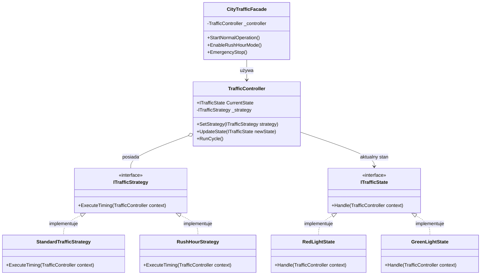

```mermaid
classDiagram
    class CityTrafficFacade {
        -TrafficController _controller
        +StartNormalOperation()
        +EnableRushHourMode()
        +EmergencyStop()
    }

    class TrafficController {
        +ITrafficState CurrentState
        -ITrafficStrategy _strategy
        +SetStrategy(ITrafficStrategy strategy)
        +UpdateState(ITrafficState newState)
        +RunCycle()
    }

    class ITrafficState {
        <<interface>>
        +Handle(TrafficController context)
    }

    class RedLightState {
        +Handle(TrafficController context)
    }

    class GreenLightState {
        +Handle(TrafficController context)
    }

    class ITrafficStrategy {
        <<interface>>
        +ExecuteTiming(TrafficController context)
    }

    class StandardTrafficStrategy {
        +ExecuteTiming(TrafficController context)
    }

    class RushHourStrategy {
        +ExecuteTiming(TrafficController context)
    }

    CityTrafficFacade --> TrafficController : używa
    TrafficController o-- ITrafficStrategy : posiada
    TrafficController --> ITrafficState : aktualny stan

    ITrafficState <|.. RedLightState : implementuje
    ITrafficState <|.. GreenLightState : implementuje
    ITrafficStrategy <|.. StandardTrafficStrategy : implementuje
    ITrafficStrategy <|.. RushHourStrategy : implementuje
```
